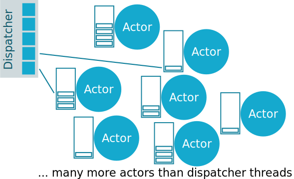

@@@section { data-background-color="#15a8ce" data-background-image="./front-bg.svg" }

###  Managing Blocking in Akka

#### Arnout Engelen


@notes[Hi! I'm Arnout from the Akka team, and today, we will look at blocking when using Akka.]

@@@

@@@section

1. Why is blocking dangerous?
1. Using a custom dispatcher

@notes[If you have been using Akka, you have probably heard it is
bad to use blocking code inside an actor. In this video we will
see:<br>
 * why blocking is dangerous<br>
 * how you can use a custom dispatcher if you must block]

@@@

@@@section


@notes[When programming using actors, each actor receives messages
in its mailbox. The actor system will make sure each message
for an actor is processed sequentially.]

@@@

@@@section



@notes[<p>The internal Akka component that drives the message processing is
called the dispatcher. A dispatcher is shared by many actors. 
Informally, you can think of it as a thread pool that will
pick an actor that has messages in its mailbox and is not currently
processing.
</p><p>
Because you have a limited number of CPU's anyway, as long as actors
never block it is very efficient to have many more actors than threads.
However, when some actors block, that can make your dispatcher run out
of threads.
</p>]

@@@

@@@section

@@snip[PrintActor.scala]($root$/src/main/scala/PrintActor.scala)

@@snip[NoBlocking.scala]($root$/src/main/scala/NoBlocking.scala)

@notes[Let's show this problem with some code: here we create 100 actors
that print the number we send to it.]

@@@

@@@section

```
[2019-12-12 12:16:19,886] [INFO] [PrintActor$] - 2
[2019-12-12 12:16:19,886] [INFO] [PrintActor$] - 1
[2019-12-12 12:16:19,886] [INFO] [PrintActor$] - 3
[2019-12-12 12:16:19,887] [INFO] [PrintActor$] - 4
[2019-12-12 12:16:19,887] [INFO] [PrintActor$] - 5
[2019-12-12 12:16:19,888] [INFO] [PrintActor$] - 6
[2019-12-12 12:16:19,888] [INFO] [PrintActor$] - 7
[2019-12-12 12:16:19,888] [INFO] [PrintActor$] - 8
[2019-12-12 12:16:19,888] [INFO] [PrintActor$] - 9
[2019-12-12 12:16:19,888] [INFO] [PrintActor$] - 10
[2019-12-12 12:16:19,888] [INFO] [PrintActor$] - 11
[2019-12-12 12:16:19,889] [INFO] [PrintActor$] - 12
[2019-12-12 12:16:19,889] [INFO] [PrintActor$] - 13
[2019-12-12 12:16:19,889] [INFO] [PrintActor$] - 14
[2019-12-12 12:16:19,889] [INFO] [PrintActor$] - 15
[2019-12-12 12:16:19,889] [INFO] [PrintActor$] - 16
[2019-12-12 12:16:19,889] [INFO] [PrintActor$] - 17
[2019-12-12 12:16:19,890] [INFO] [PrintActor$] - 18
[2019-12-12 12:16:19,890] [INFO] [PrintActor$] - 19
[2019-12-12 12:16:19,890] [INFO] [PrintActor$] - 20
[2019-12-12 12:16:19,890] [INFO] [PrintActor$] - 21
[2019-12-12 12:16:19,890] [INFO] [PrintActor$] - 22
[2019-12-12 12:16:19,890] [INFO] [PrintActor$] - 23
[2019-12-12 12:16:19,890] [INFO] [PrintActor$] - 24
[2019-12-12 12:16:19,891] [INFO] [PrintActor$] - 25
[2019-12-12 12:16:19,891] [INFO] [PrintActor$] - 26
[2019-12-12 12:16:19,891] [INFO] [PrintActor$] - 27
[2019-12-12 12:16:19,891] [INFO] [PrintActor$] - 28
[2019-12-12 12:16:19,891] [INFO] [PrintActor$] - 29
[2019-12-12 12:16:19,891] [INFO] [PrintActor$] - 30
[2019-12-12 12:16:19,891] [INFO] [PrintActor$] - 31
[2019-12-12 12:16:19,891] [INFO] [PrintActor$] - 32
[2019-12-12 12:16:19,892] [INFO] [PrintActor$] - 33
[2019-12-12 12:16:19,892] [INFO] [PrintActor$] - 34
[2019-12-12 12:16:19,892] [INFO] [PrintActor$] - 35
[2019-12-12 12:16:19,892] [INFO] [PrintActor$] - 36
[2019-12-12 12:16:19,892] [INFO] [PrintActor$] - 37
[2019-12-12 12:16:19,892] [INFO] [PrintActor$] - 38
[2019-12-12 12:16:19,892] [INFO] [PrintActor$] - 39
[2019-12-12 12:16:19,893] [INFO] [PrintActor$] - 40
[2019-12-12 12:16:19,893] [INFO] [PrintActor$] - 41
[2019-12-12 12:16:19,893] [INFO] [PrintActor$] - 43
[2019-12-12 12:16:19,893] [INFO] [PrintActor$] - 42
[2019-12-12 12:16:19,893] [INFO] [PrintActor$] - 44
[2019-12-12 12:16:19,893] [INFO] [PrintActor$] - 45
[2019-12-12 12:16:19,894] [INFO] [PrintActor$] - 46
[2019-12-12 12:16:19,894] [INFO] [PrintActor$] - 47
[2019-12-12 12:16:19,894] [INFO] [PrintActor$] - 48
[2019-12-12 12:16:19,894] [INFO] [PrintActor$] - 49
[2019-12-12 12:16:19,894] [INFO] [PrintActor$] - 50
[2019-12-12 12:16:19,894] [INFO] [PrintActor$] - 51
[2019-12-12 12:16:19,894] [INFO] [PrintActor$] - 52
[2019-12-12 12:16:19,894] [INFO] [PrintActor$] - 53
[2019-12-12 12:16:19,895] [INFO] [PrintActor$] - 54
[2019-12-12 12:16:19,895] [INFO] [PrintActor$] - 55
[2019-12-12 12:16:19,895] [INFO] [PrintActor$] - 56
[2019-12-12 12:16:19,895] [INFO] [PrintActor$] - 57
[2019-12-12 12:16:19,895] [INFO] [PrintActor$] - 58
[2019-12-12 12:16:19,896] [INFO] [PrintActor$] - 59
[2019-12-12 12:16:19,896] [INFO] [PrintActor$] - 60
[2019-12-12 12:16:19,896] [INFO] [PrintActor$] - 61
[2019-12-12 12:16:19,896] [INFO] [PrintActor$] - 62
[2019-12-12 12:16:19,896] [INFO] [PrintActor$] - 63
[2019-12-12 12:16:19,897] [INFO] [PrintActor$] - 64
[2019-12-12 12:16:19,897] [INFO] [PrintActor$] - 65
[2019-12-12 12:16:19,897] [INFO] [PrintActor$] - 66
[2019-12-12 12:16:19,897] [INFO] [PrintActor$] - 67
[2019-12-12 12:16:19,897] [INFO] [PrintActor$] - 68
[2019-12-12 12:16:19,897] [INFO] [PrintActor$] - 69
[2019-12-12 12:16:19,897] [INFO] [PrintActor$] - 70
[2019-12-12 12:16:19,898] [INFO] [PrintActor$] - 71
[2019-12-12 12:16:19,898] [INFO] [PrintActor$] - 72
[2019-12-12 12:16:19,898] [INFO] [PrintActor$] - 73
[2019-12-12 12:16:19,898] [INFO] [PrintActor$] - 74
[2019-12-12 12:16:19,898] [INFO] [PrintActor$] - 75
[2019-12-12 12:16:19,898] [INFO] [PrintActor$] - 76
[2019-12-12 12:16:19,898] [INFO] [PrintActor$] - 77
[2019-12-12 12:16:19,898] [INFO] [PrintActor$] - 78
[2019-12-12 12:16:19,898] [INFO] [PrintActor$] - 79
[2019-12-12 12:16:19,899] [INFO] [PrintActor$] - 80
[2019-12-12 12:16:19,899] [INFO] [PrintActor$] - 81
[2019-12-12 12:16:19,899] [INFO] [PrintActor$] - 82
[2019-12-12 12:16:19,899] [INFO] [PrintActor$] - 83
[2019-12-12 12:16:19,899] [INFO] [PrintActor$] - 84
[2019-12-12 12:16:19,899] [INFO] [PrintActor$] - 85
[2019-12-12 12:16:19,899] [INFO] [PrintActor$] - 86
[2019-12-12 12:16:19,899] [INFO] [PrintActor$] - 87
[2019-12-12 12:16:19,899] [INFO] [PrintActor$] - 88
[2019-12-12 12:16:19,900] [INFO] [PrintActor$] - 89
[2019-12-12 12:16:19,900] [INFO] [PrintActor$] - 90
[2019-12-12 12:16:19,900] [INFO] [PrintActor$] - 91
[2019-12-12 12:16:19,900] [INFO] [PrintActor$] - 92
[2019-12-12 12:16:19,900] [INFO] [PrintActor$] - 93
[2019-12-12 12:16:19,900] [INFO] [PrintActor$] - 94
[2019-12-12 12:16:19,900] [INFO] [PrintActor$] - 95
[2019-12-12 12:16:19,900] [INFO] [PrintActor$] - 96
[2019-12-12 12:16:19,901] [INFO] [PrintActor$] - 97
[2019-12-12 12:16:19,901] [INFO] [PrintActor$] - 98
[2019-12-12 12:16:19,901] [INFO] [PrintActor$] - 99
[2019-12-12 12:16:19,901] [INFO] [PrintActor$] - 100
```

@notes[All good. Now let's see what happens when we simulate blocking
inside half of the actors]

@@@

@@@section

@@snip[BlockingActor.scala]($root$/src/main/scala/BlockingActor.scala)

@@snip[BlockingWrong.scala]($root$/src/main/scala/BlockingWrong.scala)

@notes[We now create 50 non-blocking actors, and 50 actors that block the
dispatcher thread.]

@@@

@@@section

```
[2019-12-12 12:28:14,084] [INFO] [PrintActor$] - 11
[2019-12-12 12:28:14,084] [INFO] [BlockingActor$] - Started: 11
[2019-12-12 12:28:14,085] [INFO] [PrintActor$] - 12
[2019-12-12 12:28:14,085] [INFO] [BlockingActor$] - Started: 12
[2019-12-12 12:28:14,085] [INFO] [PrintActor$] - 13
[2019-12-12 12:28:14,086] [INFO] [BlockingActor$] - Started: 13
[2019-12-12 12:28:14,086] [INFO] [PrintActor$] - 14
[2019-12-12 12:28:14,086] [INFO] [BlockingActor$] - Started: 14
[2019-12-12 12:28:14,086] [INFO] [PrintActor$] - 15
[2019-12-12 12:28:14,087] [INFO] [BlockingActor$] - Started: 15
[2019-12-12 12:28:14,097] [INFO] [PrintActor$] - 16
[2019-12-12 12:28:14,097] [INFO] [BlockingActor$] - Started: 16
```
```
[2019-12-12 12:28:19,077] [INFO] [BlockingActor$] - Finished: 1
[2019-12-12 12:28:19,077] [INFO] [PrintActor$] - 17
[2019-12-12 12:28:19,078] [INFO] [BlockingActor$] - Finished: 2
[2019-12-12 12:28:19,078] [INFO] [BlockingActor$] - Started: 17
[2019-12-12 12:28:19,078] [INFO] [PrintActor$] - 18
[2019-12-12 12:28:19,078] [INFO] [BlockingActor$] - Started: 18
[2019-12-12 12:28:19,079] [INFO] [BlockingActor$] - Finished: 3
```

@notes[We see the PrintActor process the first 16 or so messages immediately, but then it is stuck for 5 seconds: all dispatcher threads are busy handling the blocking calls into the blocking actor.]

@@@

@@@section { data-background="#15a9ce" }

## key takeaway

> Blocking inside an actor is bad, because blocking in one actor can starve the dispatcher and prevent other actors from making progress.

If you have a [Lightbend Subscription](https://www.lightbend.com/lightbend-platform-subscription), you can configure our [Thread Starvation Detector](https://doc.akka.io/docs/akka-enhancements/current/starvation-detector.html) to diagnose such issues.

@@@

@@@section

@@snip[application.conf]($root$/src/main/resources/application.conf)

application.conf


@notes[That is good to understand, but what if you really need to block? Sometimes a 3rd-party API provides no
alternative to blocking. In such a case, you could introduce a dedicated
dispatcher for your blocking calls. Let's return to our example.
What we can do is introduce a second dispatcher that is dedicated to running our
blocking actors. Such dispatchers are configured in your application.conf]

@@@

@@@section

@@snip[BlockingRight.scala]($root$/src/main/scala/BlockingRight.scala) { #snip }

@notes[We can specify the dispatcher to use when spawning the actors]

@@@

@@@section

```
[2019-12-12 12:43:41,666] [INFO] [PrintActor$] - 46
[2019-12-12 12:43:41,666] [INFO] [PrintActor$] - 47
[2019-12-12 12:43:41,666] [INFO] [PrintActor$] - 48
[2019-12-12 12:43:41,666] [INFO] [PrintActor$] - 49
[2019-12-12 12:43:41,666] [INFO] [PrintActor$] - 50
[2019-12-12 12:43:46,650] [INFO] [BlockingActor$] - Finished: 1
[2019-12-12 12:43:46,651] [INFO] [BlockingActor$] - Finished: 2
[2019-12-12 12:43:46,651] [INFO] [BlockingActor$] - Started: 18
[2019-12-12 12:43:46,651] [INFO] [BlockingActor$] - Started: 17
[2019-12-12 12:43:46,651] [INFO] [BlockingActor$] - Finished: 3
[2019-12-12 12:43:46,651] [INFO] [BlockingActor$] - Started: 19
```

@notes[All 50 messages to our non-blocking actor are immediately
delivered, and our blocking actor is still using a limited number of
threads]

@@@

@@@section { data-background-color="#15a8ce" data-background-image="./front-bg.svg" }

### Links

* [https://github.com/raboof/akka-blocking-dispatcher](https://github.com/raboof/akka-blocking-dispatcher)
* [https://doc.akka.io/docs/akka](https://doc.akka.io/docs/akka/current/typed/dispatchers.html#blocking-needs-careful-management)
* [https://doc.akka.io/docs/akka-enhancements](https://doc.akka.io/docs/akka-enhancements/current/starvation-detector.html)
* [https://www.lightbend.com/videos-and-webinars](https://www.lightbend.com/videos-and-webinars)


@@@
